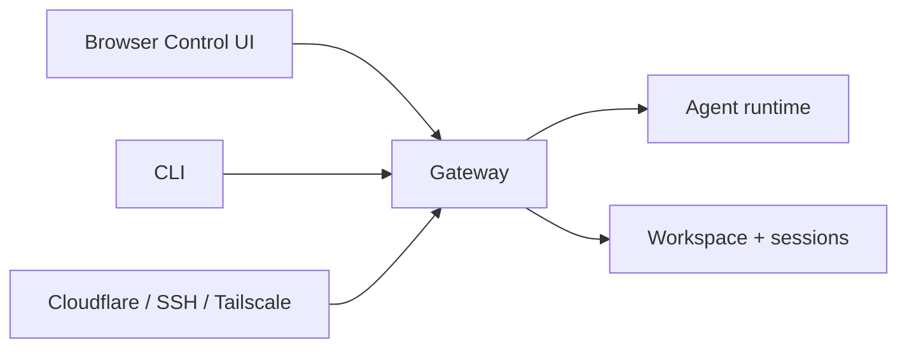

# Penguins

<p align="center">
    
    
</p>

<p align="center">
  <strong>Private AI gateway with a browser Control UI and CLI.</strong><br />
  Run Penguins on your own machine or server, then reach it locally or through a private tunnel.
</p>

<Columns>
  <Card title="Get Started" href="/start/getting-started" icon="rocket">
    Install Penguins and bring up the Gateway in minutes.
  </Card>
  <Card title="Run the Wizard" href="/start/wizard" icon="sparkles">
    Guided setup with `penguins onboard`.
  </Card>
  <Card title="Private remote access" href="/gateway/cloudflare-tunnel" icon="shield">
    Put the browser UI behind Cloudflare Tunnel + Access.
  </Card>
</Columns>

## What is Penguins?

Penguins is a **self-hosted gateway** for AI coding agents. You run a single
Gateway process on your own machine or server, then use the built-in browser
Control UI or the CLI to chat, manage sessions, configure auth, and operate the
agent.

**Who is it for?** Developers and power users who want a personal AI assistant
without giving up control of their data, workspace, or deployment shape.

**What makes it different?**

- **Self-hosted**: runs on your hardware, your rules
- **Private by default**: local browser first, with Cloudflare/SSH/Tailscale for remote access
- **Agent-native**: built for coding agents with tool use, sessions, memory, and multi-agent routing
- **Open source**: MIT licensed, community-driven

**What do you need?** Node 22+, an API key (Anthropic recommended), and 5 minutes.

## How it works



The Gateway is the single source of truth for sessions, routing, auth, and
workspace-backed state.

## Key capabilities

<Columns>
  <Card title="Browser Control UI" icon="monitor">
    Chat, sessions, config, and status in one local-first web surface.
  </Card>
  <Card title="CLI operations" icon="terminal">
    Run onboarding, config, health checks, logs, and automations from the terminal.
  </Card>
  <Card title="Multi-agent routing" icon="route">
    Isolated sessions per agent, workspace, or sender.
  </Card>
  <Card title="Private remote access" icon="shield">
    Use Cloudflare Tunnel + Access, SSH, or Tailscale without exposing the Gateway publicly.
  </Card>
  <Card title="Workspace-driven behavior" icon="folder-open">
    Store agent instructions, memory, and bootstrap files in your own workspace.
  </Card>
  <Card title="Automation and tools" icon="wrench">
    Combine cron jobs, web tools, browser automation, and custom skills.
  </Card>
</Columns>

## Quick start

<Steps>
  <Step title="Install Penguins">
    ```bash
    curl -fsSL https://penguins.ai/install.sh | bash
    ```
  </Step>
  <Step title="Onboard and install the service">
    ```bash
    penguins onboard --install-daemon
    ```
  </Step>
  <Step title="Open the Control UI">
    ```bash
    penguins dashboard
    ```
  </Step>
</Steps>

Need the full install and dev setup? See [Getting Started](/start/getting-started).

## Dashboard

Open the browser Control UI after the Gateway starts.

- Local default: [http://127.0.0.1:18789/](http://127.0.0.1:18789/)
- Remote access: [Web surfaces](/web), [Cloudflare Tunnel](/gateway/cloudflare-tunnel), and [Remote access](/gateway/remote)

## Start here

<Columns>
  <Card title="Docs hubs" href="/start/hubs" icon="book-open">
    All docs and guides, organized by use case.
  </Card>
  <Card title="Configuration" href="/gateway/configuration" icon="settings">
    Core Gateway settings, tokens, and provider config.
  </Card>
  <Card title="Remote access" href="/gateway/remote" icon="globe">
    SSH and tailnet access patterns.
  </Card>
  <Card title="Cloudflare Tunnel" href="/gateway/cloudflare-tunnel" icon="shield">
    Recommended private HTTPS access for the browser UI.
  </Card>
  <Card title="Help" href="/help" icon="life-buoy">
    Common fixes and troubleshooting entry point.
  </Card>
</Columns>

## Learn more

<Columns>
  <Card title="Full feature list" href="/concepts/features" icon="list">
    Browser, automation, routing, and workspace capabilities.
  </Card>
  <Card title="Multi-agent routing" href="/concepts/multi-agent" icon="route">
    Workspace isolation and per-agent sessions.
  </Card>
  <Card title="Dashboard" href="/web/dashboard" icon="layout-dashboard">
    Browser chat, URL helpers, and auth behavior.
  </Card>
  <Card title="Security" href="/gateway/security" icon="shield">
    Tokens, allowlists, and safety controls.
  </Card>
  <Card title="Troubleshooting" href="/gateway/troubleshooting" icon="wrench">
    Gateway diagnostics and common errors.
  </Card>
  <Card title="About and credits" href="/reference/credits" icon="info">
    Project origins, contributors, and license.
  </Card>
</Columns>
