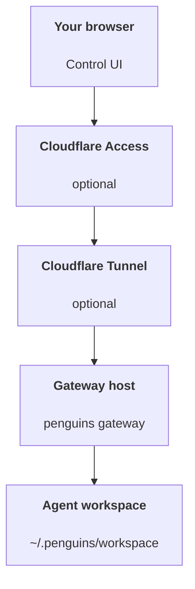

# Building a personal assistant with Penguins

Penguins works best as a **private browser-first assistant**: one Gateway on
your machine or server, one Control UI in the browser, and optional private
remote access through Cloudflare Tunnel + Access, SSH, or Tailscale.

## ⚠️ Safety first

You’re putting an agent in a position to:

- run commands on your machine (depending on your Pi tool setup)
- read/write files in your workspace

Start conservative:

- Keep `gateway.bind="loopback"` unless you fully understand the exposure.
- Keep gateway auth enabled.
- Put remote browser access behind [Cloudflare Tunnel](/gateway/cloudflare-tunnel), SSH, or Tailscale instead of binding publicly.
- Heartbeats now default to every 30 minutes. Disable until you trust the setup by setting `agents.defaults.heartbeat.every: "0m"`.

## Prerequisites

- Penguins installed and onboarded — see [Getting Started](/start/getting-started) if you haven't done this yet
- Credentials for at least one model provider
- A host where the Gateway will run
- A private hostname and Cloudflare Tunnel if you want browser access away from the host

## Recommended shape

You want this:



Local-only is even simpler: open `http://127.0.0.1:18789/` directly on the
gateway host and skip the tunnel.

## 5-minute quick start

1. Onboard and install the service:

```bash
penguins onboard --install-daemon
```

2. Check the Gateway:

```bash
penguins gateway status
```

3. Open the local Control UI:

```bash
penguins dashboard
```

4. Add private remote access if you want it:

- [Cloudflare Tunnel](/gateway/cloudflare-tunnel) for private HTTPS
- [Remote access](/gateway/remote) for SSH or Tailscale patterns

When onboarding finishes, Penguins can auto-open the dashboard and print a
clean (non-tokenized) link. If the Control UI prompts for auth, paste the token
from `gateway.auth.token` into Control UI settings. To reopen later, run
`penguins dashboard`.

## Give the agent a workspace (AGENTS)

Penguins reads operating instructions and “memory” from its workspace directory.

By default, Penguins uses `~/.penguins/workspace` as the agent workspace, and will create it (plus starter `AGENTS.md`, `SOUL.md`, `TOOLS.md`, `IDENTITY.md`, `USER.md`, `HEARTBEAT.md`) automatically on setup/first agent run. `BOOTSTRAP.md` is only created when the workspace is brand new (it should not come back after you delete it). `MEMORY.md` is optional (not auto-created); when present, it is loaded for normal sessions. Subagent sessions only inject `AGENTS.md` and `TOOLS.md`.

Tip: treat this folder like Penguins’s “memory” and make it a git repo (ideally private) so your `AGENTS.md` + memory files are backed up. If git is installed, brand-new workspaces are auto-initialized.

```bash
penguins setup
```

Full workspace layout + backup guide: [Agent workspace](/concepts/agent-workspace)
Memory workflow: [Memory](/concepts/memory)

Optional: choose a different workspace with `agents.defaults.workspace` (supports `~`).

```json5
{
  agents: {
    defaults: {
      workspace: "~/.penguins/workspace",
    },
  },
}
```

If you already ship your own workspace files from a repo, you can disable bootstrap file creation entirely:

```json5
{
  agents: {
    defaults: {
      skipBootstrap: true,
    },
  },
}
```

## The config that turns it into “an assistant”

Penguins defaults to a good browser-first assistant setup, but you’ll usually
want to tune:

- persona/instructions in `SOUL.md`
- gateway auth and remote access
- thinking defaults (if desired)
- heartbeats (once you trust it)

Example:

```json5
{
  gateway: {
    bind: "loopback",
    trustedProxies: ["127.0.0.1", "::1"],
    auth: {
      mode: "trusted-proxy",
      trustedProxy: {
        userHeader: "cf-access-authenticated-user-email",
      },
    },
  },
  agents: {
    defaults: {
      model: "anthropic/claude-opus-4-6",
      workspace: "~/.penguins/workspace",
      thinkingDefault: "high",
      timeoutSeconds: 1800,
      heartbeat: { every: "0m" },
    },
  },
}
```

If you are not using Cloudflare Access, keep `gateway.auth.mode` on token or
password auth instead. The safest baseline is still: loopback bind plus strong
gateway auth.

## Sessions and memory

- Session files: `~/.penguins/agents/<agentId>/sessions/{{SessionId}}.jsonl`
- Session metadata (token usage, last route, etc): `~/.penguins/agents/<agentId>/sessions/sessions.json` (legacy: `~/.penguins/sessions/sessions.json`)
- `/new` or `/reset` starts a fresh session for that chat (configurable via `resetTriggers`). If sent alone, the agent replies with a short hello to confirm the reset.
- `/compact [instructions]` compacts the session context and reports the remaining context budget.

## Heartbeats (proactive mode)

By default, Penguins runs a heartbeat every 30 minutes with the prompt:
`Read HEARTBEAT.md if it exists (workspace context). Follow it strictly. Do not infer or repeat old tasks from prior chats. If nothing needs attention, reply HEARTBEAT_OK.`
Set `agents.defaults.heartbeat.every: "0m"` to disable.

- If `HEARTBEAT.md` exists but is effectively empty (only blank lines and markdown headers like `# Heading`), Penguins skips the heartbeat run to save API calls.
- If the file is missing, the heartbeat still runs and the model decides what to do.
- If the agent replies with `HEARTBEAT_OK` (optionally with short padding; see `agents.defaults.heartbeat.ackMaxChars`), Penguins suppresses outbound delivery for that heartbeat.
- Heartbeats run full agent turns — shorter intervals burn more tokens.

```json5
{
  agents: {
    defaults: {
      heartbeat: { every: "30m" },
    },
  },
}
```

## Operations checklist

```bash
penguins status          # local status (creds, sessions, queued events)
penguins status --all    # full diagnosis (read-only, pasteable)
penguins status --deep   # adds gateway health probes
penguins health --json   # gateway health snapshot (WS)
```

Logs live under `/tmp/penguins/` (default: `penguins-YYYY-MM-DD.log`).

## Next steps

- Dashboard: [Dashboard](/web/dashboard)
- Control UI: [Control UI](/web/control-ui)
- Private HTTPS: [Cloudflare Tunnel](/gateway/cloudflare-tunnel)
- Gateway ops: [Gateway runbook](/gateway)
- Cron + wakeups: [Cron jobs](/automation/cron-jobs)
- Windows status: [Windows (WSL2)](/platforms/windows)
- Linux status: [Linux](/platforms/linux)
- Security: [Security](/gateway/security)
